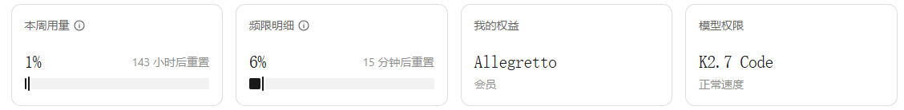

# 图片压缩对比工具

一个基于 Node.js + Sharp 的本地 Web 图片压缩与对比工具。

## 功能

- 递归扫描指定目录下的图片（JPEG/PNG/WebP/AVIF/GIF/SVG）
- 根据文件大小阈值 / 最低质量 / 策略自动压缩
- 压缩副本存入项目 `cache/` 目录，不直接覆盖原图
- Web UI 左右对比原图与压缩图
- 鼠标悬停局部放大，左右同步
- 一键将压缩后的图片替换原图（自动备份，可撤销）

## 使用方法

### 1. 安装依赖

```bash
npm install
```

### 2. 修改配置（可选）

编辑 `config.json`：

```json
{
  "targetDir": "E:/Data/BJTU/NJU1/15.Blog/my-blog/source/_posts/2603-japan",
  "maxFileSizeKB": 500,
  "minQuality": 65,
  "strategy": "size_first"
}
```

策略说明：
- `size_first`：优先满足文件大小阈值，逐步降低质量
- `quality_first`：优先保证最低质量
- `balanced`：在质量与大小之间取平衡

### 3. 启动服务

```bash
npm start
```

服务默认运行在 http://localhost:3456

### 4. 打开浏览器使用

访问 http://localhost:3456，点击“扫描并压缩”，等待处理完成后：
- 左侧列表显示所有图片及压缩信息
- 点击任意图片在右侧进行对比
- 鼠标悬停在图片上可局部放大
- 勾选需要替换的图片，点击“应用选中替换”
- 如需恢复，勾选后点击“撤销选中”

## 目录结构

```
image-compressor-web/
├── backend/          # Express 后端
├── frontend/         # Web UI
├── cache/            # 压缩缓存与备份
├── config.json       # 配置文件
└── package.json
```

## 注意事项

- 替换原图前会自动备份到 `cache/<hash>/backup/`
- 缓存目录位于当前项目下，不会污染博客仓库
- GIF 和 SVG 暂不做压缩处理

---

# Kimi Code K2.7测试

- 耗时
  - 半个小时
- 正确率
  - 完美完成每个要求，并且会自己细化需求，贴合使用体验
  - 在前后端、小工具这块，完美胜任
- Token开销
  - 
